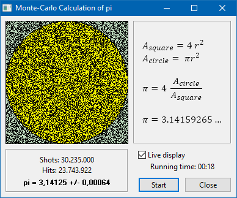

# pi
Monte-Carlo simulation to calculate pi

## Description ##

This small projects demonstrates the concepts of Monte-Carlo integration: 
A circle of radius r has the area . 
A square tightly enclosing the circle has length , 
and its area is .
The area ratio of circle to square is .

The areas can be estimated by Monte-Carlo integration: Two uniformly distributed random numbers, x and y, are drawn with a value between 0 and 4. 
These values represent the coordinates of a random point inside the square. With some probability, however, the point is also within the circle.
This probability is given by the area ratio of circle to square. What the calculation does is to repeat this many times and to count how many
points lie within the circle. The ratio of points inside the circle to the total number of points is approximately 
equal to the area ratio of circle to square, and thus .
Of course, the better the more points are tested. 
After testing a large number of points,  can be approximated to be the 4-fold count ratio.

Note that the calculation converges only very slowly - definitely not good to calculate thousands of decimal places of pi, 
but I think it is fascinating that the value of  can be estimated simply by counting!
